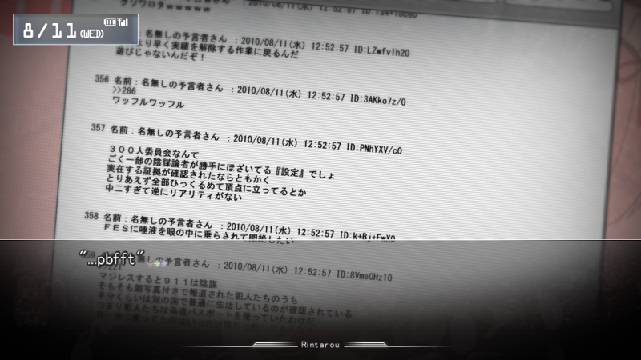

# [@channel](http://atchannel.space/)
The goal of this website is to replicate the @channel from the anime Steins;Gate as much as possible (making this basically a parody of 4chan). Here you will find various channels dedicated to a variety of topics created by users. Users do not need to register an account before participating in a channel.

**@channel as portrayed in the anime**


**@channel as portrayed in the VN**


## Setup for development
1) Before cloning this repo, make sure you have pip, `python 2.7.x`, `mongo`, and `mongod` installed.

2) @channel stores everything on a MongoDB database. On mongo, you will need to make create a database called `atchannel` and in that, make sure these 3 collections exist: `messages`, `channels`, and `comments`. Enter the mongo shell and enter the commands:
```mongo
> use atchannel
> db.createCollection("messages")
> db.createCollection("channels")
> db.createCollection("comments")
```

3) @channel just requires 2 channels to exist before launching the server: the `main` channel, and a `Suggestions` channel. On the mongo shell, enter:
```mongo
> db.channels.insert({_id: "main", seq: 0, time: Date.now(), description: "This is the main channel in @channel. Feel free to post anything about anything."})
> db.channels.insert({_id: "Suggestions", seq: 0, time: Date.now(), description: "Post any suggestions you feel could improve @channel or features you would like to see on @channel."})
```

4) You can now exit the shell. Before starting the server, make sure you have the python dependencies installed by running:
```sh
$ pip install -r requirements.txt -t lib
```
This will install the dependencies in the `lib` directory, and each one will eventually be added onto the python classpath.

5) Create the python files missing from the `private` directory. The file names and their contents are listed in [private/README.md](/private/README.md).

6) Start the mongo server with `sudo mongod` and `python __init__.py` to start the flask server on localhost. Post 5000 is the default.

## Setup for Production
In [this README](PRODUCTION.md).

## Contributing
Feel free to fork this repo and develop on it as much as you like. I would love nothing more than having people help develop @channel, especially since I am a total noob at flask and mongodb. If you think you can improve the code, feel free to submit a pull request. If multiple people want to consitently develop and contribute to @channel. I will make this repo into an organization so it will be easier to invite people.

## Dependencies
**Installed via pip**
- Flask
- pymongo
- requests

**Javascript dependencies (included)**
- jQuery
- TextFill
- Mobile Detect
- Bootstrap
- Bootstrap Switch
- Bootstrap Markdown
- Bootstrap Image Gallery
- reCaptcha

## Updates
In [this README](UPDATES.md).

## Todo
<ul>
	<li>Find new way for resizing markdown content in each post. `Zoom` does not work in Firefox or IE, but does work on Chrome and Safari.</li>
	<li>Add stats to front page and channel pages. (http://flask.pocoo.org/snippets/71/ & http://stackoverflow.com/questions/12770950/flask-request-remote-addr-is-wrong-on-webfaction-and-not-showing-real-user-ip for getting number of users)</li>
	<li>Add reply and report buttons to each post.</li>
	<li>Add channel search.</li>
	<li>Add post search.</li>
	<li>Add pagination to each channel.</li>
	<li>Add ability to choose user icon.</li>
</ul>